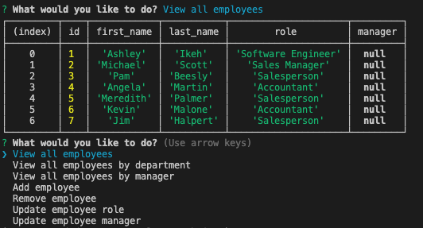
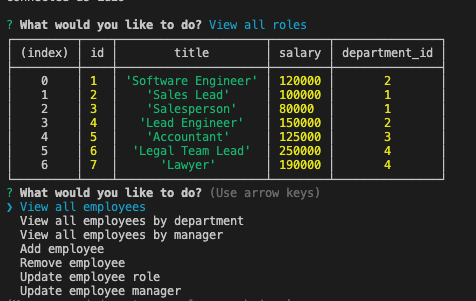

 
# Employee-Tracker

The Employee Tracker is an easy-to-use command management system that helps you archive information about your business. You can store data on everything ranging from your employee's names to role salaries, departments, and much more! This application is useful for all business types from the mom-and-pop shop to a fortune 500 company with thousands of personnel. If you need a visual medium to sort all of the employees in your company, the Employee Tracker is for you.

 

## Content
* [Installation](#installation)
* [Updates](#updates)
* [License](#license)
* [Credits](#credits)

## Installation

To view the github repository for this project, please [click here](https://github.com/Aikeh2021/Employee-Tracker). Please [click here](https://drive.google.com/file/d/1ti2LsmTMb1sU_c9RYozrkSZGXi7bl0uj/view) to view a video about the app's functionality.

## Updates

The Employee Tracker application is still being updated. Currently the application is workout to improve the join features for the different tables in the application's database. Please revisit this application in the future to view the app's functionality in it's entirety.

## License

MIT License

Copyright (c) 2021 [Ashley Ikeh](https://github.com/Aikeh2021)

Permission is hereby granted, free of charge, to any person obtaining a copy
of this software and associated documentation files (the "Software"), to deal
in the Software without restriction, including without limitation the rights
to use, copy, modify, merge, publish, distribute, sublicense, and/or sell
copies of the Software, and to permit persons to whom the Software is
furnished to do so, subject to the following conditions:

The above copyright notice and this permission notice shall be included in all
copies or substantial portions of the Software.

THE SOFTWARE IS PROVIDED "AS IS", WITHOUT WARRANTY OF ANY KIND, EXPRESS OR
IMPLIED, INCLUDING BUT NOT LIMITED TO THE WARRANTIES OF MERCHANTABILITY,
FITNESS FOR A PARTICULAR PURPOSE AND NONINFRINGEMENT. IN NO EVENT SHALL THE
AUTHORS OR COPYRIGHT HOLDERS BE LIABLE FOR ANY CLAIM, DAMAGES OR OTHER
LIABILITY, WHETHER IN AN ACTION OF CONTRACT, TORT OR OTHERWISE, ARISING FROM,
OUT OF OR IN CONNECTION WITH THE SOFTWARE OR THE USE OR OTHER DEALINGS IN THE
SOFTWARE.

## Credits
* [SQL Joins For Beginners](https://m.youtube.com/watch?v=2HVMiPPuPIM)
* [Performing Queries](https://github.com/mysqljs/mysql#performing-queries)
* [SQL Joins](https://www.w3schools.com/sql/sql_join.asp)
* [SQL Update](https://www.w3schools.com/sql/sql_update.asp)
